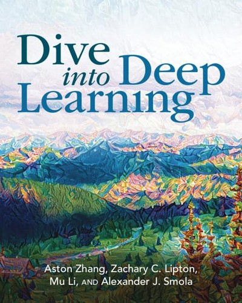

<p align="center">
  
</p>

<table>
  <tr>
    <td width="230" align="center">
      <a href="https://d2l.ai/">
        
      </a>
    </td>
    <td valign="middle">
      <h2>Dive into Deep Learning</h2>
      <p><strong>Source-faithful PyTorch Practice</strong></p>
      <p>
        교재의 수식과 알고리즘을 PyTorch notebook으로 직접 구현하고,<br />
        Tensor shape, data flow, training behavior를 실행하며 검증한 학습 기록.
      </p>
    </td>
  </tr>
</table>

<br />

---

## Selected Implementations

### Foundations

| Representative Notebook | Main Concept |
|---|---|
| [Automatic Differentiation](src/ch02_preliminaries/sec2_5_automatic_differentiation/01_a_simple_function.ipynb) | Computation graph와 gradient propagation |
| [Linear Regression](src/ch03_linear_neural_networks_for_regression/sec3_5_concise_implementation_of_linear_regression/01_concise_linear_regression.ipynb) | Model, loss, optimizer, training loop |
| [Softmax & Cross-Entropy](src/ch04_linear_neural_networks_for_classification/sec4_5_concise_softmax_regression/02_softmax_revisited.ipynb) | Logit, probability, numerically stable loss computation |
| [MLP from Scratch](src/ch05_multilayer_perceptrons/sec5_2_implementation_of_multilayer_perceptrons/01_mlp_from_scratch.ipynb) | Hidden Layer와 nonlinear representation |

### Generalization & Model Selection

| Representative Notebook | Main Concept |
|---|---|
| [Dropout from Scratch](src/ch05_multilayer_perceptrons/sec5_6_dropout/01_dropout_from_scratch.ipynb) | Stochastic regularization과 training/inference behavior |
| [K-Fold Cross-Validation](src/ch05_multilayer_perceptrons/sec5_7_predicting_house_prices_on_kaggle/01_kaggle_house_price_prediction.ipynb) | Validation strategy와 model selection |

### Core Neural Architectures (CNNs & RNNs)

| Representative Notebook | Main Concept |
|---|---|
| [LeNet](src/ch07_convolutional_neural_networks/sec7_6_lenet/01_lenet_architecture.ipynb) | Convolution, pooling, hierarchical feature extraction |
| [ResNet](src/ch08_modern_convolutional_neural_networks/sec8_6_residual_networks_resnet_and_resnext/02_resnet_model.ipynb) | Residual connection과 deep network optimization |
| [Elman RNN from Scratch](src/ch09_recurrent_neural_networks/sec9_5_recurrent_neural_network_implementation_from_scratch/01_rnn_model.ipynb) | Recurrent state와 sequential computation |
| [LSTM from Scratch](src/ch10_modern_recurrent_neural_networks/sec10_1_long_short_term_memory_lstm/01_lstm_from_scratch.ipynb) | Gating mechanism과 long-term dependency |

### Attention & Transformers

| Representative Notebook | Main Concept |
|---|---|
| [Sequence-to-Sequence Translation](src/ch10_modern_recurrent_neural_networks/sec10_7_sequence_to_sequence_learning_for_machine_translation/03_seq2seq_training_and_prediction.ipynb) | Encoder–Decoder와 autoregressive decoding |
| [Multi-Head Attention from Scratch](src/ch11_attention_mechanisms_and_transformers/sec11_5_multi_head_attention/01_multi_head_attention.ipynb) | Query, Key, Value와 parallel attention heads |
| [Transformer Training & Attention](src/ch11_attention_mechanisms_and_transformers/sec11_7_the_transformer_architecture/05_transformer_training_and_attention.ipynb) | Self-Attention, causal mask, Encoder–Decoder |
| [Vision Transformer](src/ch11_attention_mechanisms_and_transformers/sec11_8_transformers_for_vision/03_vision_transformer.ipynb) | Patch Embedding, ViT Block, image classification |

### Optimization Algorithms

| Representative Notebook | Main Concept |
|---|---|
| [Gradient Descent and Newton's Method](src/ch12_optimization_algorithms/sec12_3_gradient_descent/03_newton_method_and_preconditioning.ipynb) | First-order update, Hessian, preconditioning |
| [Minibatch SGD from Scratch](src/ch12_optimization_algorithms/sec12_5_minibatch_stochastic_gradient_descent/03_minibatch_sgd_from_scratch.ipynb) | Statistical efficiency와 computational efficiency |
| [Momentum from Scratch](src/ch12_optimization_algorithms/sec12_6_momentum/04_momentum_from_scratch.ipynb) | Velocity state, gradient averaging, accelerated convergence |
| [Adagrad from Scratch](src/ch12_optimization_algorithms/sec12_7_adagrad/02_adagrad_from_scratch.ipynb) | Cumulative squared gradient와 coordinate-wise learning rate |
| [RMSProp from Scratch](src/ch12_optimization_algorithms/sec12_8_rmsprop/02_rmsprop_from_scratch.ipynb) | Leaky squared-gradient average와 adaptive scaling |
| [Adadelta from Scratch](src/ch12_optimization_algorithms/sec12_9_adadelta/01_adadelta_from_scratch.ipynb) | Gradient와 parameter-update second moment |
| [Adam from Scratch](src/ch12_optimization_algorithms/sec12_10_adam/01_adam_from_scratch.ipynb) | First/second moment, bias correction, adaptive update |
| [Warmup & Cosine Scheduling](src/ch12_optimization_algorithms/sec12_11_learning_rate_scheduling/05_warmup.ipynb) | Linear warmup, cosine decay, learning-rate dynamics |

---

## Voyage Log

### Completed Route

| Chapter | Topic | Progress |
|:---:|---|:---:|
| 1 | Introduction | ✅ Done |
| 2 | Preliminaries | ✅ Done |
| 3 | Linear Neural Networks for Regression | ✅ Done |
| 4 | Linear Neural Networks for Classification | ✅ Done |
| 5 | Multilayer Perceptrons | ✅ Done |
| 6 | Builders' Guide | ✅ Done |
| 7 | Convolutional Neural Networks | ✅ Done |
| 8 | Modern Convolutional Neural Networks | ✅ Done |
| 9 | Recurrent Neural Networks | ✅ Done |
| 10 | Modern Recurrent Neural Networks | ✅ Done |
| 11 | Attention Mechanisms and Transformers | ✅ Done |
| 12 | Optimization Algorithms | ✅ Done |

### Forward Route

| Chapter | Topic | Progress |
|:---:|---|:---:|
| **13** | **Computational Performance** | **Committed** |
| 14 | Computer Vision | If Time Allows |
| 15 | Natural Language Processing: Pretraining | If Time Allows |
| 16 | Natural Language Processing: Applications | If Time Allows |
| 17 | Reinforcement Learning | Optional |
| 18 | Gaussian Processes | Optional |
| 19 | Hyperparameter Optimization | Optional |
| 20 | Generative Adversarial Networks | Optional |

---

## Repository Map

```text
src/
├── ch02_preliminaries/                              38 notebooks
├── ch03_linear_neural_networks_for_regression/      17 notebooks
├── ch04_linear_neural_networks_for_classification/  11 notebooks
├── ch05_multilayer_perceptrons/                      7 notebooks
├── ch06_builders_guide/                             15 notebooks
├── ch07_convolutional_neural_networks/               9 notebooks
├── ch08_modern_convolutional_neural_networks/       15 notebooks
├── ch09_recurrent_neural_networks/                  12 notebooks
├── ch10_modern_recurrent_neural_networks/           14 notebooks
├── ch11_attention_mechanisms_and_transformers/      21 notebooks
└── ch12_optimization_algorithms/                    33 notebooks
```

## Run Locally

### 1. Clone and open

```bash
git clone https://github.com/Laplace-tech/maverick.git
cd maverick
code .
```

### 2. Select the notebook kernel

VS Code interpreter와 kernel:

```text
Interpreter: .venv/bin/python
Kernel:      Python (maverick)
```

### 3. Activate in the terminal

Terminal에서 environment를 직접 사용할 때:

```bash
source .venv/bin/activate
python
```

<br />

<p align="center">
  <sub>Study archive based on <a href="https://d2l.ai/">Dive into Deep Learning</a>.</sub>
</p>

<p align="center">
  
</p>
